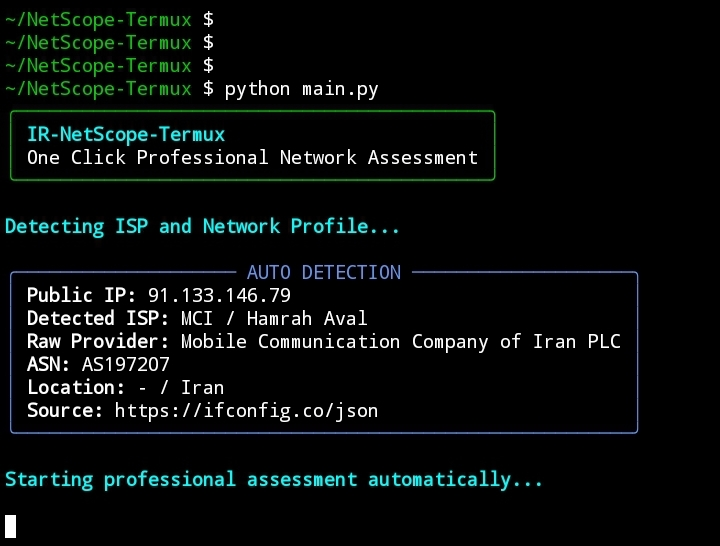
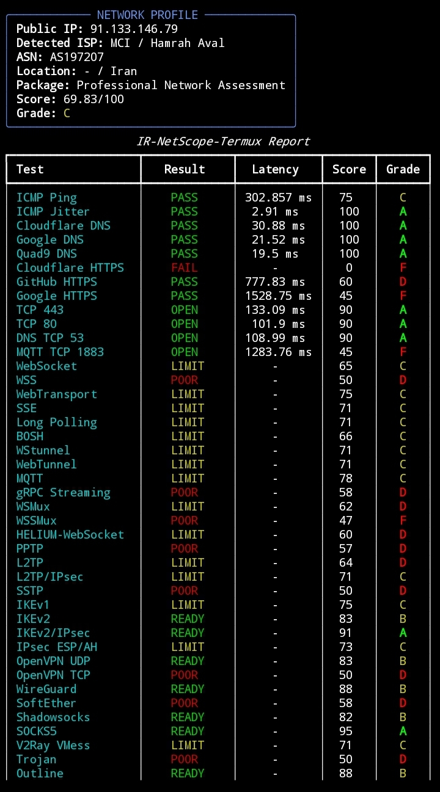
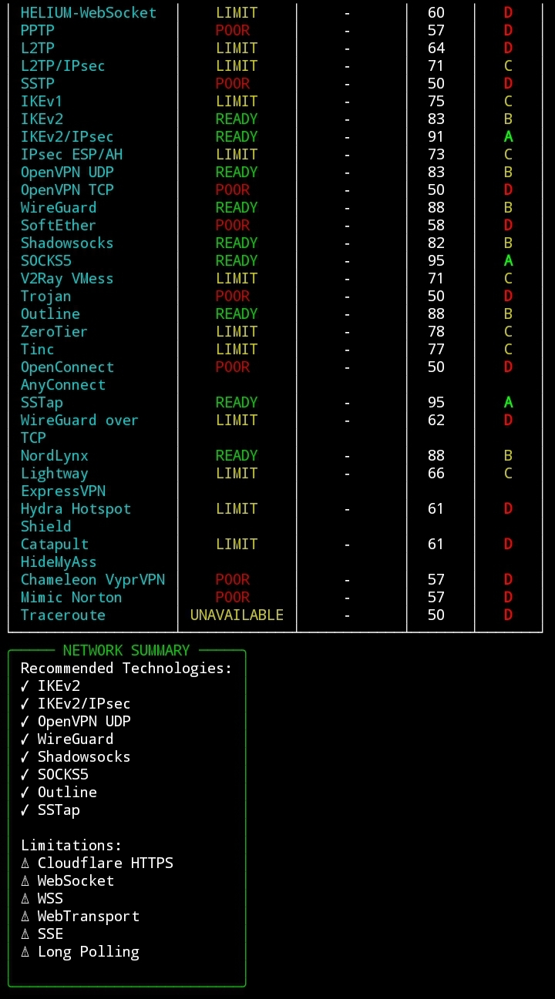

# IR-NetScope-Termux


Professional Network Assessment Tool for Android Termux

## Screenshots

### Auto Detection



### Core Network Report



### VPN & Protocol Readiness




## Installation Guide (Android Termux)

###Step 1 - Update Packages

```bash
pkg update -y && pkg upgrade -y
```

###Step 2 - Grant Storage Permission
```bash
termux-setup-storage
```

###Step 3 - Install Requirements
```bash
pkg install git python traceroute inetutils -y
```

###Step 4 - Clone Repository
```bash
git clone https://github.com/pars1500/IR-NetScope-Termux.git
```
###Step 5 - Enter Project Directory
```bash
cd IR-NetScope-Termux
```
###Step 6 - Install Python Dependencies

```bash
pip install -r requirements.txt
```
###Step 7 - Run Application

```bash
python main.py
```
###Updateh
```bash
cd IR-NetScope-Termux && git pull
```
###Remove
```bash
rm -rf ~/IR-NetScope-Termux
```
